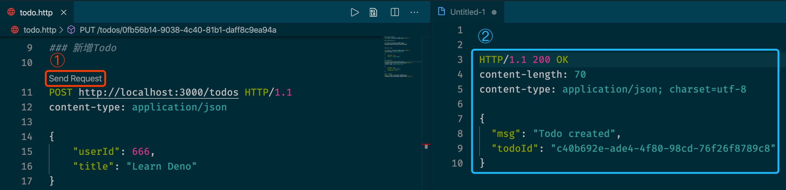

# deno-todos-api
> 创建了一个 “重学TypeScript” 的微信群，想加群的小伙伴，加我微信 **"semlinker"**，备注重学 TS。

### 一、Deno 简介 

Deno 是一个 JavaScript/TypeScript 的运行时，默认使用安全环境执行代码，有着卓越的开发体验。Deno 含有以下功能亮点：

- 默认安全。外部代码没有文件系统、网络、环境的访问权限，除非显式开启。
- 支持开箱即用的 TypeScript 的环境。
- 只分发一个独立的可执行文件（deno）。
- 有着内建的工具箱，比如一个依赖信息查看器（deno info）和一个代码格式化工具（deno fmt）。
- 有一组经过审计的 标准模块，保证能在 Deno 上工作。
- 脚本代码能被打包为一个单独的 JavaScript 文件。

Deno 是一个跨平台的运行时，即基于 Google V8 引擎的运行时环境，该运行时环境是使用 Rust 语言开发的，并使用  Tokio 库来构建事件循环系统。Deno 建立在 V8、Rust 和 Tokio 的基础上，它的架构如下：


对于 Deno 还不熟悉的读者，建议先阅读本人所写的 [了不起的 Deno 入门教程](https://mp.weixin.qq.com/s?__biz=MzI2MjcxNTQ0Nw==&mid=2247484255&idx=1&sn=dd36e32e0d501fb8e4bb33b72491ca98&chksm=ea47a207dd302b11b57f1a45c79d2e59ac0c8e7507bfa45d9177696b84c92a86ee4f56ccbdbf&token=1109281504&lang=zh_CN#rd) 这篇文章。

### 二、Deno Todos API 简介 

本项目是 Deno 实战项目，介绍使用 Oak 开发 Todo REST API，若你本机已安装 Deno，则可以按照以下步骤运行本项目：

1. 克隆本项目

```shell
$ git clone https://github.com/semlinker/deno-todos-api.git
```

2. 运行本项目

```shell
$ deno run -A index.ts
```

3. 测试 Todo API（可选）

本项目使用的是 VSCode IDE 下的 [REST Client](https://marketplace.visualstudio.com/items?itemName=humao.rest-client) 扩展，来测试 Todo REST API：

```http
### 获取Todo列表
GET http://localhost:3000/todos HTTP/1.1

### 获取Todo详情

GET http://localhost:3000/todos/${todoId}

### 新增Todo

POST http://localhost:3000/todos HTTP/1.1
content-type: application/json

{
    "userId": 666,
    "title": "Learn Deno"
}

### 更新Todo
PUT http://localhost:3000/todos/${todoId} HTTP/1.1
content-type: application/json

{
    "userId": 666,
    "title": "Learn Deno",
    "completed": true  
}

### 删除Todo
DELETE  http://localhost:3000/todos/${todoId} HTTP/1.1
```

> 友情提示：**需要注意的是 `todo.http` 文件中的 `${todoId}` 需要替换为实际的 Todo 编号，该编号可以先通过新增 Todo，然后从 `db/todos.json` 文件中获取。**

REST Client 使用示例：



### 三、目录结构说明

Todos API 项目的目录结构如下所示：

```
├── README.md
├── config.ts
├── db
├── deno-add-todo.jpg
├── deno-schematic-diagram.png
├── handlers
├── index.ts
├── middlewares
├── models
├── routing.ts
├── services
└── todo.http
```

主要目录说明：

- **handlers 目录：**存放路由处理器；
- **middlewares 目录：**存放中间件，用于处理每个请求；
- **models 目录：**存放模型定义，在我们的示例中只包含 Todo 接口；
- **services 目录：**存放服务层程序；
- **db 目录**：作为本地数据库，存放 Todo 数据；
- **config.ts：**包含应用的全局配置信息；
- **index.ts：** 应用的入口文件；
- **routing.ts：**包含 API 路由信息。

